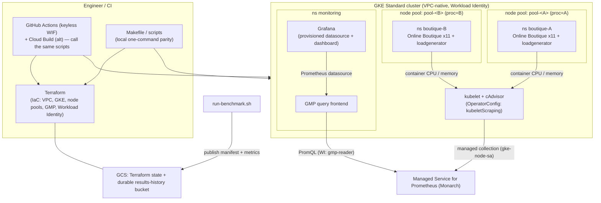
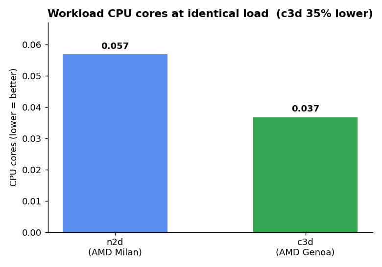

# Online Boutique — Processor Performance Benchmark

Automated platform to benchmark **CPU/memory performance of different processor generations** by
running the [Online Boutique](https://github.com/GoogleCloudPlatform/microservices-demo)
microservices demo on GKE node pools pinned to each processor, collecting metrics with **Managed
Service for Prometheus**, and comparing them in **Grafana**. Built to be re-run for new processors
and (later) other cloud providers.

> Deliverable #1 of a two-part exercise. The AI-agent design is in the companion repo
> [`ops-ai-agent`](../ops-ai-agent).

## Deliverables (requirement → location)

| Brief requirement | Where |
|---|---|
| **Online Boutique deployed** | `k8s/overlays/` + [`scripts/deploy.sh`](scripts/deploy.sh) — two copies, one per processor |
| **Metrics collected + dashboard** | Managed Service for Prometheus + Grafana → [`dashboards/boutique-benchmark.json`](dashboards/boutique-benchmark.json) (CPU & memory) |
| **Architecture diagram (automation)** | **below** · [`docs/automation-diagram.mmd`](docs/automation-diagram.mmd) · [`docs/architecture-automation.md`](docs/architecture-automation.md) |
| **Automation implemented** | Terraform (`terraform/`) + `scripts/` + keyless GitHub Actions CI/CD (`.github/workflows/`) |
| **AI agent architecture document** | companion repo → [`ops-ai-agent/docs/ai-agent-architecture.md`](../ops-ai-agent/docs/ai-agent-architecture.md) |

## Architecture diagram (automation proposal)



> The 2 processor pools (A/B) are chosen in `config/platforms.json`. Full design decisions,
> methodology, and the rendered Mermaid source: **[docs/architecture-automation.md](docs/architecture-automation.md)**.

## What it does

- Provisions a **GKE Standard** cluster with two node pools — **`pool-n2`** (`n2-standard-4`,
  prev-gen Intel) and **`pool-c3`** (`c3-standard-4`, Sapphire Rapids).
- Deploys **two identical copies** of Online Boutique, one pinned to each pool, each driven by an
  identical Locust load.
- Collects per-container **CPU/memory** via kubelet/cAdvisor into Managed Service for Prometheus.
- Visualizes a head-to-head comparison in a provisioned **Grafana dashboard**.
- Captures a benchmark **summary + raw evidence** to [`docs/results/`](docs/results).

See **[docs/architecture-automation.md](docs/architecture-automation.md)** for the architecture,
design decisions, methodology, and diagram.

## Latest result (PoC snapshot)

At identical load, **C3 (Sapphire Rapids) consumed ~24% less CPU** (~17% less CPU per request) than
N2, with ~30% lower median latency and equal memory. Charts + details:
[`docs/results/`](docs/results) (`chart-cpu.png`, `chart-cpu-per-req.png`, `chart-latency.png`) and
[`summary.md`](docs/results/summary.md).



## Prerequisites

- `gcloud`, `terraform` ≥ 1.5, `kubectl`, and **`gke-gcloud-auth-plugin`**
  (`gcloud components install gke-gcloud-auth-plugin` on a non-snap SDK).
- A GCP project with billing; APIs: container, compute, monitoring, artifactregistry, cloudbuild.
- A versioned **GCS bucket** for Terraform state (default `performance-analysis-2026-tfstate`);
  update `terraform/versions.tf` to your bucket.

## Choose the 2 processors to compare

The comparison is parametrized in **[`config/platforms.json`](config/platforms.json)** — the single
source of truth read by both Terraform and the scripts. Edit `selected` (exactly **2** distinct keys
from `catalog`); any other value **fails** `make lint` and `terraform plan`.

```json
"catalog": { "n2": ..., "n2d": ..., "c3": ..., "c3d": ..., "c4": ... },
"selected": ["n2", "c3"]
```
Supported x86 families: `n2` (Intel Cascade/Ice Lake), `n2d` (AMD Milan), `c3` (Intel Sapphire
Rapids), `c3d` (AMD Genoa), `c4` (Intel Emerald Rapids). Everything downstream — node pools, the two
Online Boutique copies, dashboard, benchmark and charts — follows automatically.

> **Processor availability is zone- and time-dependent.** A family being in the catalog means it's a
> valid choice, not that the zone has capacity *right now*. If a node never becomes Ready and the
> health check reports `ZONE_RESOURCE_POOL_EXHAUSTED`, that machine type is temporarily **stocked
> out** in `us-central1-a` (a transient GCP capacity limit, not a config error). Mitigations: retry
> later, pick another family (e.g. `n2d`/`c3d`/`c3`/`c4`), switch the zone, or use a reservation for
> guaranteed capacity. To check a type before deploying:
> `gcloud compute instances create probe --machine-type=<fam>-standard-4 --zone=us-central1-a ... && gcloud compute instances delete probe ...`

## Quick start

```bash
make lint       # static checks: terraform fmt/validate, config, yamllint, shellcheck, kustomize
make up         # terraform apply: VPC + GKE + the 2 selected node pools (~8 min)
make connect    # fetch kubeconfig
make deploy     # GMP scraping + frontend + Grafana + both copies, then health checks
make health     # re-run functional health checks on demand
make dashboards # port-forward Grafana -> http://localhost:3000 (anon viewer; admin/admin)
make bench      # soak + capture evidence + charts to docs/results/
make down       # terraform destroy (tear down to control cost)
```

## CI/CD

Real, **keyless** CI/CD via GitHub Actions + **Workload Identity Federation** (no SA keys):

- **`ci.yml`** — `make lint` (terraform fmt/validate, config, yamllint, shellcheck, kustomize) on
  every push/PR. No cloud credentials.
- **`deploy.yml`** — on merge to `main` (or manual): `terraform plan` → **manual approval**
  (`production` Environment) → `apply-infra.sh` → `deploy.sh` (with the health-check gate). Auth is
  keyless OIDC, scoped to this repo only.
- **`teardown.yml`** — manual, approval-gated `terraform destroy`.

Setup (one-time bootstrap + GitHub variables/environment): see
**[docs/cicd-setup.md](docs/cicd-setup.md)**. The pipeline calls the **same `scripts/`** as `make`
— one source of truth, no duplicated logic.

**Why GitHub Actions over Cloud Build here?** It's keyless (OIDC, no stored keys), lives where the
code/PRs are, and is **cloud-agnostic** — matching the roadmap of comparing across cloud providers.
The GCP-native **`cloudbuild/`** pipelines are retained as the alternative you'd choose when you
need **private-VPC reach** (a private GKE control plane / VPC-SC) or GCP-only governance, where
GitHub-hosted runners can't reach the control plane.

## Layout

```
config/        platforms.json — catalog + the 2 selected processors (single source of truth)
terraform/     IaC: VPC, GKE cluster, node pools (from config), GMP, Workload Identity, state
k8s/base       vendored Online Boutique (pinned v0.10.5)
k8s/overlays   boutique.kustomization.tmpl.yaml — rendered per selected platform by deploy.sh
k8s/monitoring OperatorConfig (kubelet scraping), GMP query frontend, Grafana
dashboards/    Grafana dashboard JSON (provisioned; groups by namespace)
cloudbuild/    Cloud Build pipelines (call scripts/)
scripts/       apply-infra · deploy · healthcheck · validate · run-benchmark · make-charts · lib
.github/       GitHub Actions CI (lint/validate)
docs/          architecture doc, diagram, results/
```

## Security model

Uses **Workload Identity Federation for GKE** with least-privilege service accounts
(`terraform/workload_identity.tf`): a dedicated minimal **`gke-node-sa`** on nodes, a
**`gmp-reader`** GSA (`monitoring.viewer` only) mapped to the GMP frontend KSA for Grafana's read
path, and **no Google credentials on application pods**. See
[docs/architecture-automation.md](docs/architecture-automation.md) → *Security: identity model*.

## Notes & limitations

- This is a **proof of concept** (single short run, light load). For publication-grade rigor, see
  *Production hardening* in the architecture doc.
- `gke-gcloud-auth-plugin` is required by `kubectl` for GKE; on a snap-managed gcloud you may need
  a separate SDK install or a token-based kubeconfig.
