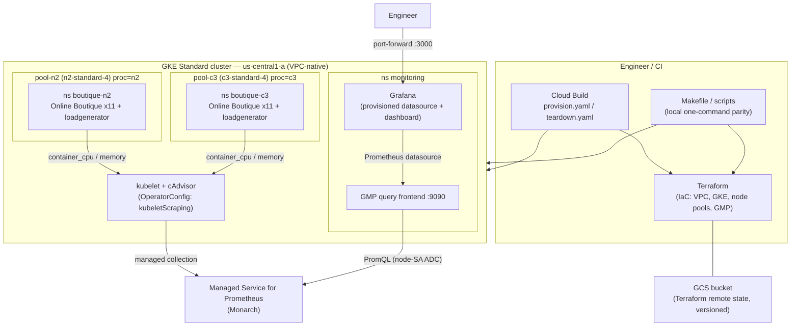

# Automation Architecture — Online Boutique Processor Benchmark

## Goal

Repeatably deploy the **Online Boutique** microservices demo on GKE, run an **identical load**
on two processor generations, and collect **CPU/memory** metrics for an apples-to-apples
comparison — fully automated so it can be re-run for new processors and (later) other clouds.

This document covers deliverable #1 (the automation). The AI-agent design is in the separate
[`ops-ai-agent`](../../ops-ai-agent) repo.

## Architecture & data flow



## Design decisions & rationale

| Decision | Why |
|---|---|
| **GKE Standard, two node pools** (`n2-standard-4`, `c3-standard-4`) | Benchmarking processors requires *pinning* machine types. Autopilot hides the node/processor, so Standard is required. Same vCPU/RAM size on both → the variable is the **processor generation**, not sizing. |
| **Two identical app copies**, one per pool, pinned via `nodeSelector: proc=<n2\|c3>` | Runs the *same* workload + *same* Locust load on each processor concurrently → a fair, simultaneous comparison. |
| **Managed Service for Prometheus + Grafana** | Managed collection = low ops. **PromQL + Grafana are portable**, so the same queries/dashboards can target other clouds later (the stated cross-cloud goal). |
| **kubelet/cAdvisor scraping** (`OperatorConfig.collection.kubeletScraping`) | Source of `container_cpu_usage_seconds_total` / `container_memory_working_set_bytes` — no app instrumentation needed. |
| **Per-app-pod CPU as the headline metric** (not per-node) | Measuring the *app containers* is robust to co-located system/monitoring overhead and is the correct way to compare **processor efficiency** (CPU consumed to serve identical load). |
| **Terraform (remote GCS state) + Cloud Build + Makefile** | IaC reproducibility with locking; Cloud Build for CI; Makefile/scripts for local one-command parity and demos. |
| **Dedicated VPC-native network** | Isolation + explicit pod/service ranges; doesn't depend on the default VPC. |
| **Automated teardown** | `make down` / `teardown.yaml` runs `terraform destroy` to control cost. |

## Benchmark methodology

1. Both copies run the bundled Locust **loadgenerator** with identical config (`USERS=10, RATE=1`)
   against their in-namespace `frontend`.
2. Let the system reach steady state (~10–15 min).
3. Compare, averaged over the steady window:
   - **CPU cores consumed** by the workload per pool — the efficiency headline (lower = better).
   - **Memory working set** per pool.
   - **Throughput/latency** from the Locust logs (sanity that both served the load comparably).
4. Normalized statement: *"To serve the same load, C3 used X% less CPU than N2."*

> **Caveat (documented honestly):** light monitoring pods may share a benchmark node and cause
> minor CPU contention. Because the headline metric measures the **app containers specifically**
> (not whole-node utilization), this does not bias the efficiency comparison. For a publication-
> grade run, add a dedicated untainted `system` pool and taint the benchmark pools.

## Repository layout

```
terraform/   IaC: VPC, GKE cluster, pool-n2 / pool-c3, GMP, remote state
k8s/
  base/                 vendored Online Boutique (pinned v0.10.5)
  overlays/boutique-n2  namespace + nodeSelector(proc=n2), drops frontend-external LB
  overlays/boutique-c3  namespace + nodeSelector(proc=c3)
  monitoring/           OperatorConfig (ref), GMP frontend, Grafana
dashboards/  Grafana dashboard JSON (provisioned)
cloudbuild/  provision.yaml, teardown.yaml
scripts/     connect.sh, deploy.sh, run-benchmark.sh, teardown.sh
docs/        this doc, automation-diagram.mmd, results/
Makefile     up / connect / deploy / dashboards / bench / down
```

## How to run

```bash
make up            # terraform apply: cluster + pools (~8 min)
make connect       # kubeconfig (needs gke-gcloud-auth-plugin)
make deploy        # GMP scraping, frontend, Grafana, both boutiques
make dashboards    # port-forward Grafana -> http://localhost:3000
make bench         # soak + capture evidence to docs/results/
make down          # terraform destroy
```

## Production hardening (what I'd change beyond the PoC)

- **Workload Identity + least-privilege SAs** instead of the node SA. *(In this exercise the
  runtime SA had Editor but could not set IAM policy, so KSA→GSA bindings weren't possible; the
  node-SA path is the documented fallback. The cluster is otherwise WI-ready.)*
- **Dedicated `system` node pool** + tainted benchmark pools for fully isolated measurements.
- **Private GKE control plane**, authorized networks, and Binary Authorization.
- **Pinned, mirrored images** in Artifact Registry; Cloud Build triggers on Git push with
  approvals; policy checks (OPA/Gatekeeper).
- **Persistent Grafana/state** (Cloud SQL / GCS) and alerting policies; longer multi-run trend
  storage for regression tracking across processor generations and clouds.
